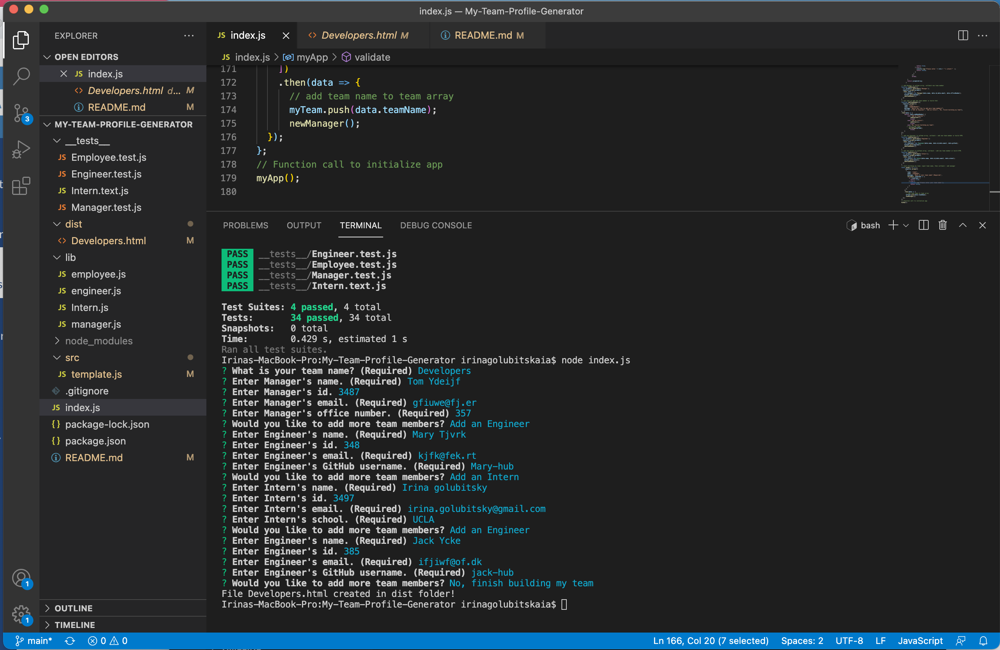

# My Team Profile Generator [](https://opensource.org/licenses/MIT)
An app to generate a Team Profile page by using a command-line 

## Technologies Used

* JavaScript (Node.js)

## Description 

A Node.js command-line application that takes in information about employees on a software engineering team and generates an HTML webpage that displays summaries for each person. Generated page displays basic info about team Manager including manager’s name, manager's ID, email address, and office number; info about each Engineer - engineer’s name, ID, email, and GitHub username; Intern's info - intern’s name, ID, email, and school. When you  click on an email address in the HTML, your default email program opens and populates the TO field of the email with the address. When you click on the GitHub username, then that GitHub profile opens in a new tab.

## Table of Contents 
- [Installation](#installation)
- [Usage](#usage)
- [Tests](#tests)
- [License](#license)
- [Demo](#demo)
- [Screenshot](#screenshot)
- [Questoins](#quedestions)
  
## Installation 
   ``` 
    npm init
    npm install jest
    npm install inquirer
   ```
  
## Usage
  Run the following command in a terminal at the root of this project 
   ```
    node index.js
   ```
   Then, answer propted questions.

## Tests
  
  jest tests: 
  Employee.test.js, Engineer.test.js, Intern.test.js, Manager.test.js (__tests__ folder)

## License 
  
  The MIT License

## Demo
  
  https://drive.google.com/file/d/13iXguW8o7cfAbSEZQKpgncC461qoQVn0/view

## Screenshot
  
  |  
   
## Questions
  If you hane any questions:
  
  Get in touch with me on Github [Irina-Golubitsky](https://github.com/Irina-Golubitsky)
  
  Email me irina.golubitsky@gmail.com

